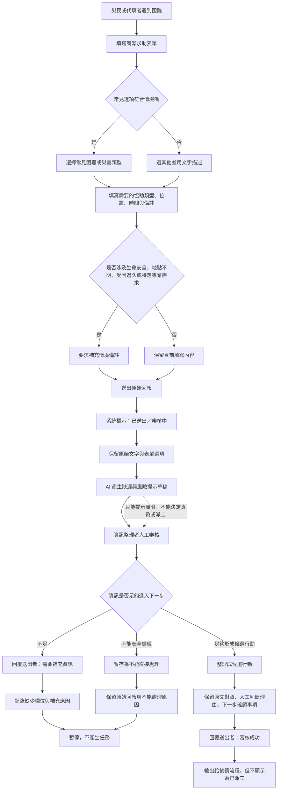

# v1 流程設計

> 這份流程是草稿，用來讓人類檢查與後續實作參考。它不是正式救災流程，也不是 AI 自動決策規則。

## v1 目標摘要

v1 的最終受益者是災民，直接使用者是資訊整理者。

這個流程的目標不是快速產生任務，而是讓災民或代填者送出的原始求助，在被整理、審核、轉交時不失真。系統應該保留原始資訊、標示不確定性、提醒人工確認，並避免把未確認資訊誤顯示成已派工或已確認。

## 自然語言流程描述

1. 災民本人或代填者用簡潔表單送出原始回報。
2. 表單先提供常見困難或災害選項；如果不符合，使用者選「其他」並用文字描述。
3. 使用者填寫目前困難、需要的協助類型、大概位置、受困或需要協助的時間，以及必要備註。
4. 如果情境與生命安全、地點不明、受困時間過長或特定專業需求有關，流程要求補充備註，但不由 AI 自動判定救援優先順序。
5. 系統收到資料後，先標示為「已送出 / 審核中」，並保留原始文字。
6. 資訊整理者查看原始回報、來源、缺漏欄位、備註與 AI 草稿提示。
7. AI 只能提示可能缺漏或風險，例如「地點不完整」「可能需要人工確認」「不能直接變成任務」，不能決定真偽、派工或行動優先順序。
8. 資訊整理者進行人工確認，判斷這筆資訊目前屬於：
   - 需要補充資訊。
   - 暫時不能處理但必須保留。
   - 可整理成候選行動。
9. 如果資訊不足，系統回覆送出者「需要補充資訊」，並記錄缺少什麼。
10. 如果不能直接處理，系統保留原始回報與原因，不讓它消失，也不把它變成任務。
11. 如果可整理成候選行動，資訊整理者保留原文對照、人工判斷理由與下一步確認事項。
12. 審核完成後，送出者只會看到「審核成功」或「需要補充資訊」等狀態；「審核成功」不等於已派工。

## Mermaid 流程圖

## 人工確認點

- 資訊整理者必須人工審核原始回報，不能只看 AI 草稿提示。
- 涉及生命安全、地點不明、受困時間過長或需要特定專業人員時，必須閱讀備註與原始描述。
- 從「原始回報」推進到「候選行動」時，必須留下人工判斷理由。
- 「審核成功」只代表資料通過整理或確認門檻，不代表已派工。

## 不能自動處理的分支

- 資訊不足：回覆送出者需要補充資訊，並記錄缺少什麼。
- 來源或內容模糊：保留為待確認線索，不能直接變成任務。
- 生命安全相關但細節不足：必須人工確認，不能由 AI 或選項自動推導協助等級。
- 不能安全處理：保留原始回報與原因，不讓需求消失，也不產生任務。

## 操作或判斷紀錄

每筆回報至少要保留：

- 原始回報文字與表單選項。
- AI 提示的缺漏或風險，但標示為草稿。
- 資訊整理者的人工判斷。
- 判斷結果：需要補充、暫時不能處理、或候選行動。
- 如果暫停或不能處理，保留原因。
- 如果審核成功，保留下一步仍需要確認的事項。

## 我檢查後修正了什麼

原本：

流程容易從「災民送出表單」直接接到「志工任務欄」或「候選任務」，讓使用者誤以為審核成功就是已派工。

修正後：

流程加入「審核中」「需要補充資訊」「暫時不能處理」「候選行動」等狀態，並明確寫出「審核成功不等於已派工」。

為什麼：

這符合 `docs/decisions.md` 中的取捨：系統最終服務災民，但 v1 先降低資訊轉交失真風險，不讓 AI 或表單選項自動決定派工。

## 仍不確定的流程點

- 哪些常見困難或災害選項最適合放在表單第一層，仍需要用災民視角檢查。
- 哪些情境必須強制填備註，例如生命安全、地點不明、受困時間過長或特定專業需求。
- 「需要補充資訊」要如何回到送出者，這一版只定義狀態，還沒有設計完整通知流程。
- 資訊整理者判斷「不能安全處理」時，後續誰負責追蹤，仍需要人類決策。
- 候選行動進一步變成可派工任務的條件尚未定義，v1 不自動處理。
